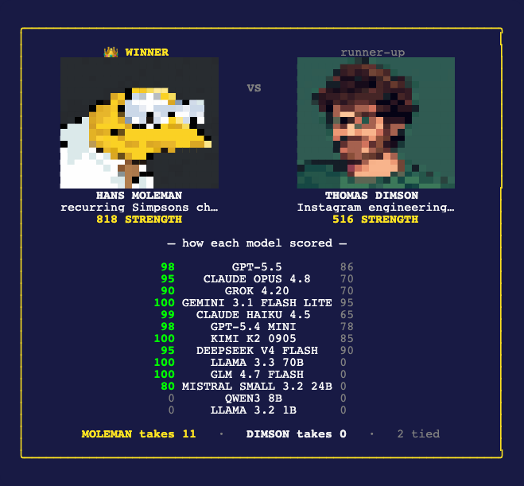

# itw — a terminal client for [intheweights.com](https://intheweights.com)

Show the [intheweights.com](https://intheweights.com) leaderboard, look up how strongly
AI models recognize a name, and render it as a **terminal profile card with a pixel
avatar** — drawn as colored half-block pixel art that looks the same in every terminal.

<p align="center">
  
</p>

This is an open-source, **read-only** client. It only reads the public leaderboard,
cached results, and avatars — it never writes anything to the site.

```
itw "paul mccartney"               # profile card
itw hans moleman v thomas dimson   # battle mode — winner on the left (above)
itw top                            # the top-20 pixel-avatar gallery
```

> One lookup shows everything: the embedded pixel avatar, the name, descriptor, the
> `STRENGTH · TOP%` line, and per-model brand-colored confidence bars. Add `--detail`
> for the headline model snippet, scores, tiers, and evidence.

## Install

**`uv tool` (recommended)** — installs the `itw` command on your PATH:

```bash
uv tool install git+https://github.com/mattsilv/itw-cli
itw "paul mccartney"
```

**`pipx`:**

```bash
pipx install git+https://github.com/mattsilv/itw-cli
```

**Zero-install (PEP 723 — uv resolves deps on the fly, no `itw` on PATH):**

```bash
uv run https://raw.githubusercontent.com/mattsilv/itw-cli/main/itw.py board
# or, from a clone:
uv run itw.py "paul mccartney"
```

From a local clone, `uv tool install .` / `pipx install .` also work.

## Usage

```bash
itw "paul mccartney"               # profile card — avatar + strength + model bars
itw "paul mccartney" --detail      # + headline snippet, scores, tiers, evidence
itw hans moleman v thomas dimson   # battle mode — winner on the left
itw top                            # the top 20 as a pixel-avatar gallery
itw board                          # leaderboard table (optional slice, default: top)
itw update                         # check for a newer release & upgrade in place
```

| Command | What it does |
| --- | --- |
| `itw "<name>"` | ⭐ Profile card — embedded avatar, strength/top-%, per-model bars |
| `itw "<name>" --detail` | Adds the per-model snippet, scores, tiers, and evidence |
| `itw <a> v <b>` | Battle mode — two fighters side by side, winner on the left 👑 |
| `itw top` | The top 20 names as a pixel-avatar gallery (adapts to your width) |
| `itw board [slice]` | Leaderboard table (default slice: `top`) |
| `itw update` | Check the latest release and upgrade (`--check` to only report) |

Quotes are optional — `itw paul mccartney` works too.

**Flags:** `--detail`, `--check`, `--version`, `-h`/`--help`.

## Battle mode

```bash
itw hans moleman v thomas dimson
itw "sam altman" v "hans moleman"
```

Renders two fighters side by side. The **higher-strength one is the winner and goes on
the left**, marked with a 👑; the other is on the right. Separate the two names with a
standalone `v`, `vs`, or `versus`. If a name has never been searched on the site it
shows the silhouette and a "not found" note (and loses).

## Staying up to date

```bash
itw update          # compares your build to the latest GitHub release, then upgrades
itw update --check  # just report whether a newer release exists — never installs
```

`itw update` reads the repo's latest [GitHub release](https://github.com/mattsilv/itw-cli/releases)
and compares it to your installed version. If a newer one exists it shows the release
notes link and offers to run the upgrade in place (it picks up `uv` or `pipx`
automatically — whichever you installed with). Releases are versioned `vX.Y.Z`; your
current version is `itw --version`.

## Generate your own avatars (optional, needs a key)

`itw` ships ~20 pixel avatars, but you can generate one for **any** name yourself. This
is the only command that needs an API key and costs money — about **$0.04 per image**
(an image model + a deterministic quantize). Everything else is free and key-less.

```bash
export OPENROUTER_API_KEY=sk-or-...        # get one at https://openrouter.ai/keys
itw generate "tiger woods"                 # ~$0.04, saved locally
itw "tiger woods"                          # now renders YOUR avatar
```

Generated avatars are stored under `~/.cache/itw/generated/` (honors `XDG_CACHE_HOME` /
`ITW_CACHE_DIR`) and **take priority** over both the bundled set and the site's hosted
image — so generating a name overrides whatever shipped. It uses
`google/gemini-2.5-flash-image` with the locked `NEAREST` + `FASTOCTREE` pixel-art
recipe. Your key is read from the environment only and never stored.

## Rendering

Avatars render as colored **half-block pixel art** (via `rich-pixels`): each glyph is
a real text cell, so the avatar composes cleanly inside the bordered card and looks
the same in every terminal, over SSH, and when piped to a file. (Terminal graphics
protocols like kitty/iTerm2 paint at the cursor and ignore a panel's interior, so an
inline image would overflow and corrupt the card — half-block avoids that entirely.)
The render uses the locked pixel-art recipe — `NEAREST` downscale + `FASTOCTREE`
color-quantize — for hard, chunky edges rather than a blurry shrink.

**Avatar source.** `itw` ships its **own** pixel avatars — generated with an image
model (`gemini-2.5-flash-image`) and quantized to a small palette — bundled in the
package so they render offline with no API key. A bundled avatar wins over the site's
hosted one (ours is built for the terminal); names with neither still render the full
card with a generic generated **silhouette** placeholder. `itw top` browses the
bundled gallery; names we intentionally didn't generate show a red ✕ placeholder.
(Try `itw alan turing` — bundled, generated, and the site hosts none for him.)

## Cache

Avatar bytes are cached on disk (default `~/.cache/itw/avatars/<slug>.png`, honoring
`XDG_CACHE_HOME` / `ITW_CACHE_DIR`) so re-renders are instant and work offline.

## Development

```bash
uv sync
uv run pytest
```

Stdlib HTTP only (no `requests`/`httpx`) to keep the install light. The card mirrors
the site's presentation; values are pinned to the current roster/prompt version and
surfaced in the `--detail` footer, so they may need updating if the site changes.

## Disclaimer

**Unofficial and unaffiliated.** This is a fan-made, read-only client and is not
built, endorsed, or supported by intheweights.com. It relies on the site's public,
**undocumented** behavior, which can change or break at any time without notice — if
a command stops working, the site likely changed. Use at your own risk. Please be a
good citizen: don't hammer the site, and respect its terms.

## License

MIT — see [LICENSE](LICENSE).
